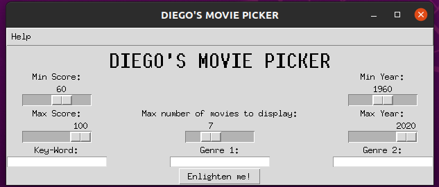
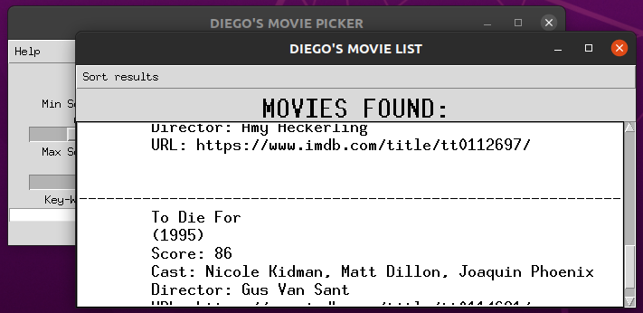

# IMDB-Database-Automatic-Movie-Picker
Graphical interface to find the perfect movie querying the IMDB database. Video on my [Linkedln post](https://www.linkedin.com/feed/update/urn:li:activity:6710466352265617408/)

## Python Package Requirements

- Tkinter
- Pandas
- IMDBpy
- Numpy

## Description

A Tkinter-based GUI for the movie enthusiasts that hate spending hours looking for the perfect movie to see in a Saturday night. With some basic parameters, you can query the 23 MILLION movies that are in the IMDB database.
Every movie is sent as a request to the database so it takes A LOT of time getting the info, so, when you are ready to start the search, go and get a tea or make some popcorn meanwhile. All the GUI looks like a GUI made by an back-end developer, so..., yeah...

The results are shown in a scrolling window with the results formatted as plain text. THEN you can SORT them by box-office $$, alphabetical or by score; so you don't even have to spend time looking for that. Art should be accessible. As long as you have money to rent the movie on Amazon.

## Usage

Select your year and score range. Then, you can select or a key-word or up to two genres. The query can take A LOT of time (~10min). Same movie query should get different random results every time.
Can select up to two genres from: action, adventure, animation, children, comedy, crime, documentary, drama, fantasy, film-noir, horror, musical, mystery, romance, sci-fi, thriller, war and western. SHOULD BE THE SAME NAME AS SET HERE.
you can select a theme (ie. aliens, superheroes, weddings, ... ). The results should be VERY different for the same key-word query.

## Troubleshoot

Should take a lot of time, up to 10 minutes. If no results were found or the movies are not satifing, search again without changing anything and should change the output. YOU CAN'T SELECT KEYWORDS AND GENRES, JUST ONE OF BOTH.

## Images

## Why does it take time?

The IMDB API supports certain queries and I had to +- adapt the code. So the search is inefficient. Sorry but I'm just a human.

